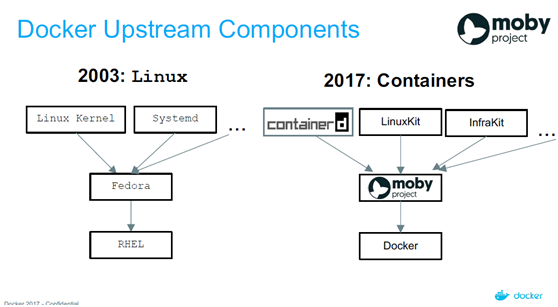
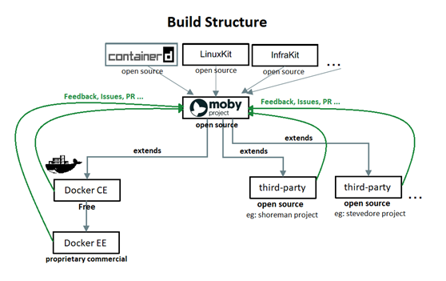

title: 當個懶惰的聰明人 - 實戰 CI/CD 與 container
output: index.html

--

<h1 style="font-size: 72px">
	當個懶惰的聰明人 
	實戰 CI/CD 與 container
</h1>
 

## Denny Huang
## 2018/07/12 @ 中央研究院 資訊服務處

--

### Who am I ?

 
<h2 style="font-size: 60px">
  <b>Denny Huang</b>
</h2>

* 雷亞遊戲 Rayark Inc.

* SITCON 2013, 2014 總召

* <a href="https://denny.one/" target="_blank">About me</a>

--

# Survey

--

# Open Source / FLOSS

--

# PR

--

# Git

--

# VM

--

# [Example - Moby](https://github.com/moby/moby)

--

<h1 style="font-size: 72px">
	Git Flow 
	GitHub Flow 
	GitLab Flow
</h1>

--

	
	<a href="http://nvie.com/posts/a-successful-git-branching-model/" target="_blank">src</a>

--

### CI/CD Tools

- Jenkins

- Travis CI

- GitLab CI

- ...

--

### CI/CD

- Build

- Test

- Deploy

--

# Demo repo
## [Testing](https://github.com/denny0223/TOSW-test) / [SITCON 2018](https://github.com/sitcon-tw/2018/)

--

### Jenkins

	

--

# Package Management

--

# Container

--

# Container / VM

--

# Docker

--

# Docker / Moby

--

	

  
    Source:&nbsp;
	<a href="http://www.infoq.com/cn/news/2017/05/Moby-LinuxKit-Docker" target="_blank">
	全面解讀Moby和LinuxKit，Docker稱溝通不善招致誤解</a>
  

--

	

  
    Source:&nbsp;
	<a href="http://www.infoq.com/cn/news/2017/05/Moby-LinuxKit-Docker" target="_blank">
	全面解讀Moby和LinuxKit，Docker稱溝通不善招致誤解</a>
  

--

# Demo

--

# [Docker Hub](http://hub.docker.com/)

--

# [Docker Compose](https://docs.docker.com/compose/compose-file/)
## [example](https://github.com/hackmdio/docker-hackmd/blob/master/docker-compose.yml)

--

# Kubernetes / Docker Swarm

--

# Q & A

--

### References

- [An Overall View On Docker Ecosystem — Containers, Moby, Swarm, Linuxkit, containerd, Kubernetes ..](https://medium.com/devopslinks/an-overall-view-on-docker-ecosystem-containers-moby-swarm-linuxkit-containerd-kubernetes-5e4972a6a1e8)

- [Docker —— 從入門到實踐](https://legacy.gitbook.com/book/philipzheng/docker_practice/details)

--

<h1 style="font-size: 72px">
  Thanks for listening!
</h1>

   

  

<h2 style="font-size: 18px">
本投影片採用<a href="http://creativecommons.org/licenses/by-sa/3.0/tw/" target="_blank">創用 CC「姓名標示—相同方式分享 3.0 台灣」授權條款</a>
</h2>

